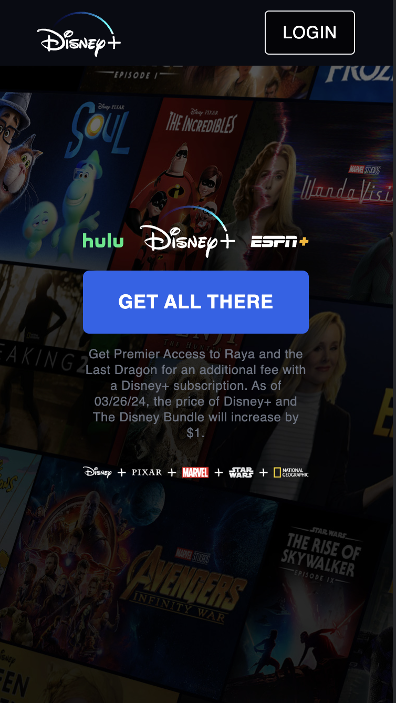
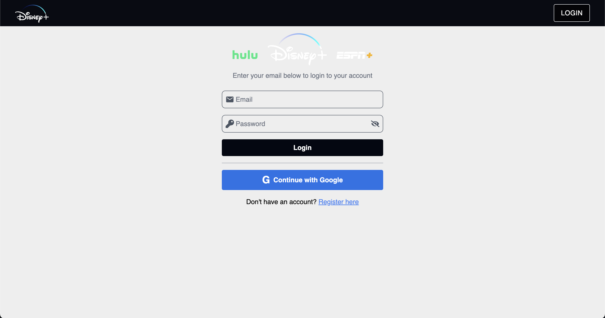
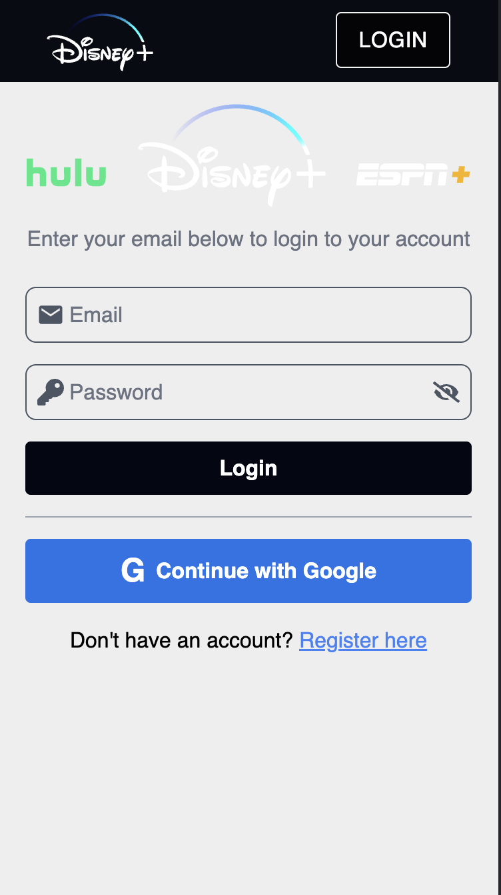
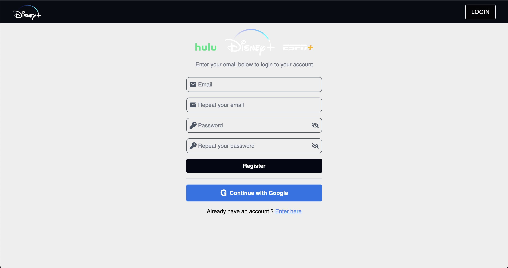
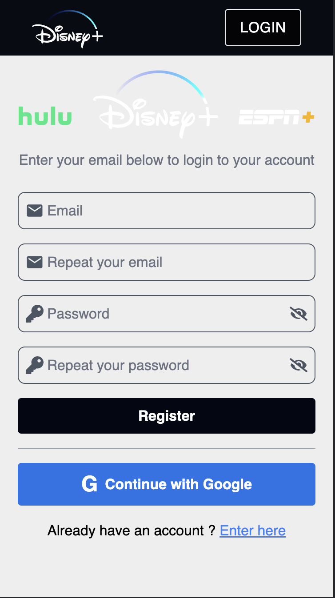
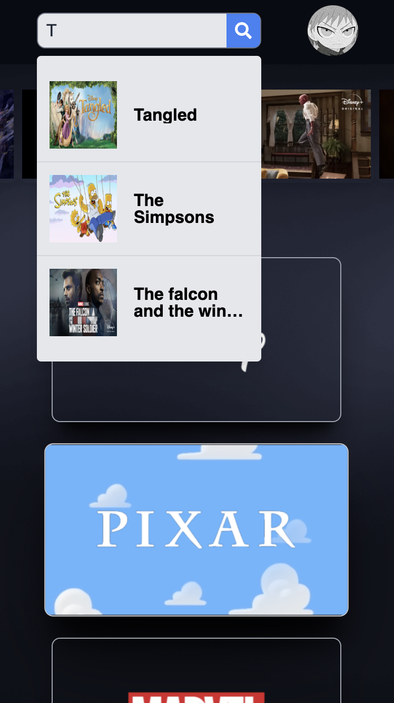
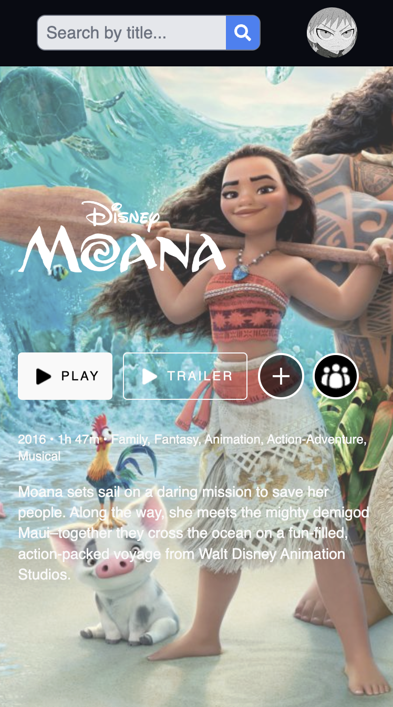
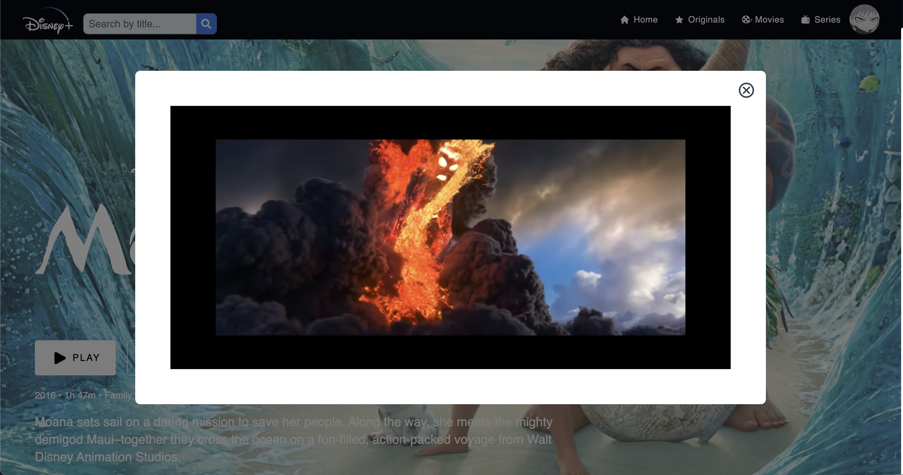
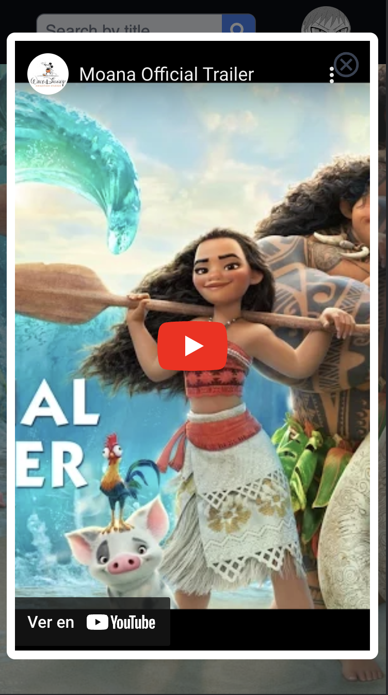

# Disney + 2.0 App

It is an app to show movies inspired by Disney + made in order to train and give the best possible user experience.

The adoption of design patterns focused on custom hooks and a feature-based or modular architecture in our application offers multiple significant advantages. Custom hooks promote code reuse, allowing encapsulation and sharing of state logic among various components, which saves time, reduces code duplication and improves overall productivity.
The modular architecture allows us to separate the underlying logic from the UI-related code in our components, making the components lighter and facilitating collaboration between developers working on different aspects of the application.

### Setup Environment

The project was created in react with the help of vite. [ See official docs](https://vitejs.dev/guide/) to set up the environment.

### Run

**Environment**

First you need to create an ".env" file taking as an example the ".env.example" file for the environment configuration, in case you don't have or don't know the credentials, ask for them by mail.

**Install dependencies**

```
yarn
```
**Run Development environment**

```
yarn dev
```

### 🛠 Tech and Libraries

- [React](https://react.dev/learn): Library js
- [TypeScript](https://www.typescriptlang.org/): Application typing stronger
- [tailwindcss](https://tailwindcss.com/docs/installation):CSS framework that takes a utility-first approach, allowing developers to build layouts quickly without the need to write custom CSS
- [React Router](https://reactrouter.com/en/main/start/tutorial): Routing and navigation
- [Redux Toolkit](https://redux-toolkit.js.org/Í): Data storage efficient Redux
- [React Hook Form](https://react-hook-form.com/get-started): Build scalable and performant forms
- [yup](https://www.npmjs.com/package/yup): Object schema validation in JavaScript
- [Firebase](https://firebase.google.com/docs/web/setup?hl=es): Servicio en la nube para gestionar login, registro y las tablas y estructura de datos
- [Sonner](https://sonner.emilkowal.ski/getting-started): Alert manager with user-friendly interface

### Web Screenshots

|                  |                           Web                           |                             Mobile                         |
| :--------------: | :-----------------------------------------------------: | :--------------------------------------------------------: |
|  Welcome Screen  |   |   |
|   Login Screen   |     |     |
| Register Screen  |  |  |
|   Home Screen    |      |      |
|  Details Screen  |   |   |
|   Modal Screen   |     |     |

# Link-video-demo-app

[](https://www.youtube.com/watch?v=9fZCRcARte8)